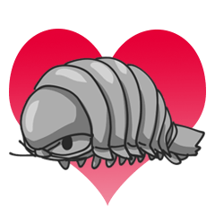
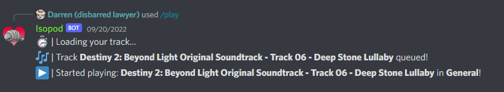
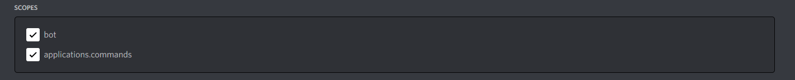

# Isopod





Isopod is a cute little music bot, created because our old music bot - Goodbot - was taken offline.

He's really cute.

## Features
- Support for Youtube, Spotify (even playlists), SoundCloud, bandcamp, etc.
- Queueing
- Skipping
- Stopping
- Now Playing

For more commands, you can always run /help.

## Not a tutorial, but here's the gist on how to run it.
You'll need to have set up an application in the [Discord Developer Portal](https://discord.com/developers/docs/intro) if you don't have one created already.
Configure the app's OAuth2 scopes as the following:



As for permissions, you can just check "Administrator" if you're planning on hosting the bot yourself (like I currently am).

Then:
1. Install "node.js" - any version will do.
2. CD into the directory via command prompt.
3. Create a config.json file, and copy and paste the JSON string below this list. Replace "YOUR_KEY_HERE" with the key on your app's General tab.
4. Run "npm i"
5. After npm i is finished, type and run "node index.js".
6. Finally, invite the bot to your server and type "!deploy" into a text chat. The bot will then deploy it's slash commands for you to use!

JSON STRING:
```json
{
    "token": "YOUR_KEY_HERE"
}
```

